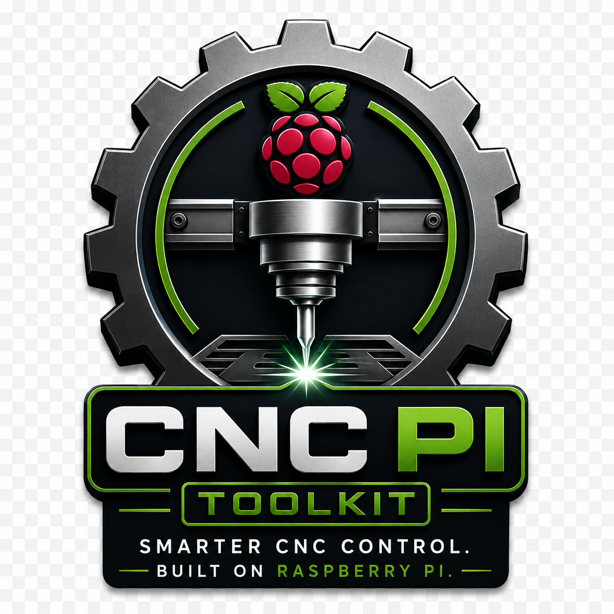

<p align="center">
  
</p>

<h1 align="center">CNC Pi Toolkit</h1>

<p align="center">
  Smarter CNC control on Raspberry Pi
</p>

<p align="center">
  
  
  
  
</p>

## Overview

CNC Pi Toolkit is a modular toolkit for preparing, maintaining and
diagnosing a Raspberry Pi CNC control system.

It automates system verification, software installation, OpenBuilds CONTROL
setup, serial communication and GRBL controller diagnostics.

## Features

### System

- Raspberry Pi hardware detection
- Raspberry Pi OS verification
- Architecture detection
- Network and system diagnostics
- CPU temperature and storage information

### Software

- Git installation and verification
- Node.js installation and verification
- Automatic Electron version detection
- OpenBuilds CONTROL installation
- ARMHF native-module support

### CNC

- Serial device detection
- Serial I/O library
- GRBL communication framework
- Controller diagnostics
- OpenBuilds CONTROL verification

### Branding

- CNC Pi Toolkit boot splash
- Reboot and shutdown splash
- Branded kiosk transition
- Interactive terminal banner
- Branded installer output

## Supported platform

Currently developed and tested on:

- Raspberry Pi 4 Model B
- Raspberry Pi OS 12 Bookworm 32-bit
- ARMHF architecture
- Node.js 20
- OpenBuilds CONTROL

## Quick start

Clone the public repository:

```bash
git clone https://github.com/mark-sewell/cnc-pi-toolkit.git
cd cnc-pi-toolkit
